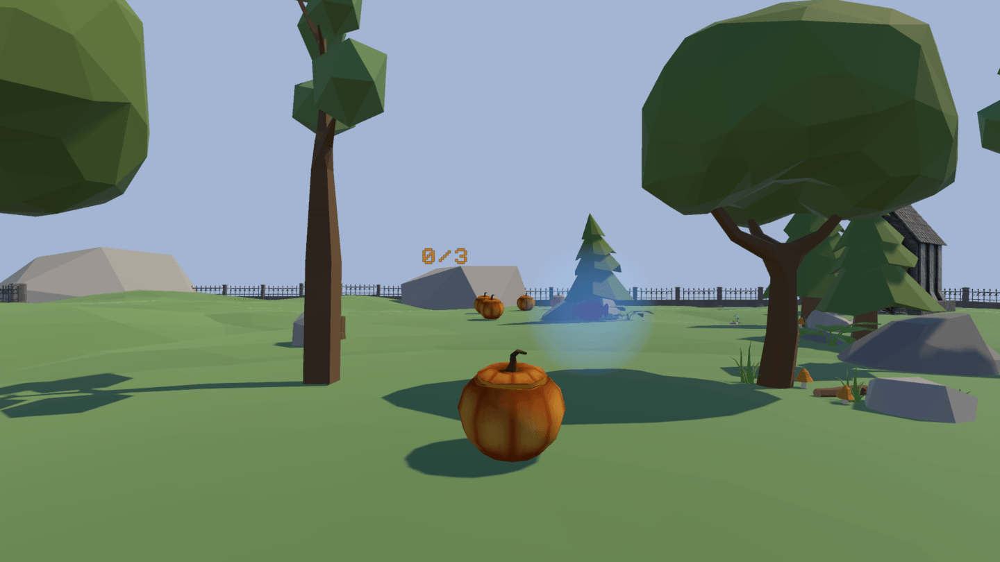
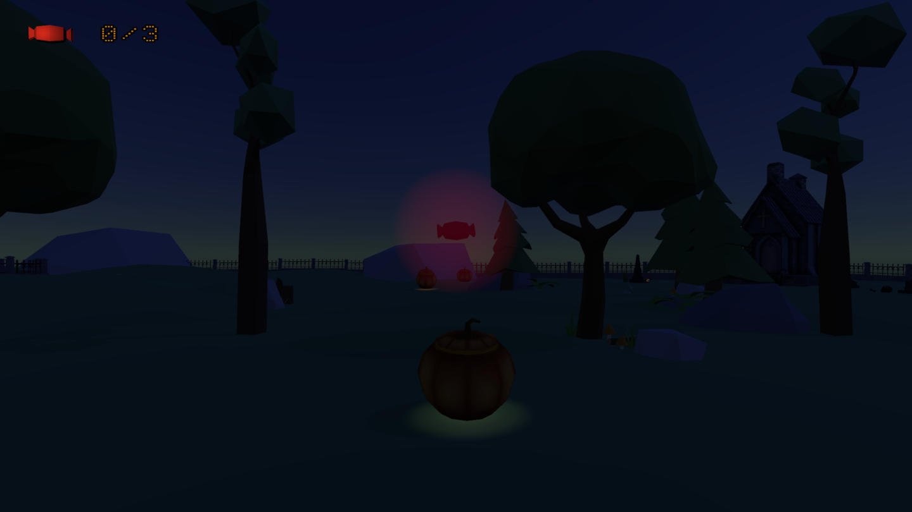

# Spoopy Treat

*Spoopy Treat* is a Unity game made for a school's recruiting process. Enjoying the concept I've found for it so much, I've decided to turn it into an actual game and will ship it as a Mofumofu product. It will be a 3D platformer, and this repository holds the demo version.  

---

## FIRST VERSION FOR THE SCHOOL

[LINK TO THIS VERSION'S LAST COMMIT](https://github.com/TheLycorisRadiata/game_unity_spoopytreat/tree/440a1a09e6b6f24df655d0fe97c3d8b10f8bf1fa)

### FEATURES
- The game is made with Unity.
- Installing it on Ubuntu (Linux) is not as straight forward as it seems. The Hub cannot open because it keeps crashing. The solution is to execute the AppImage file with the "--no-sandbox" option.
- Configuring the IDE for Unity.
- Version control has been used in the making of the project. Here is the .gitignore file for Unity: https://github.com/github/gitignore/blob/main/Unity.gitignore
- The game features no more than one scene.
- The player can move with the arrow and WASD keys (or equivalent to WASD as physical keys are used).
- The player can jump with the space bar.
- The player can collide with other objects, and go through others (the small plants).
- The player moves smoothly instead of falling over at the slightest collision.
- The camera, which is not controlled by the user, follows the player in 3rd person and is right behind them.
- A fence with high invisible walls surrounds the map so objects don't fall off it.
- In case an object, the player included, manages to go out of bounds, it is put back onto the map.
- Assets from the Unity asset store are used to compose the scene. The pumpkins weren't facing the right way, so this had to be fixed.
- Moveable objects have different masses.
- The player collects candies to increase their mass, and instead of having the character be slower because of it, I have decided to make their moving speed and jumping force proportional to their mass.
- The player can only collect 3 candies, and the current number they have collected is displayed above the player's head.
- Candies have an idle animation (made not with an actual animation but with code): they have a blue halo, bob up and down, and spin on themselves.
- The scene has 5 candies in total: one is right in front of the player when the game starts to teach them to collect it, one is kept within an enclosure that the player has to jump above to reach, another one is at the end of a small platformer bit, and the last two are inside of cauldrons.
- When a full cauldron is knocked over, a candy is created and the cauldron is replaced by an empty one.
- The game is compiled for Windows 64-bit, Windows 32-bit, Mac and Linux.

### DOWNLOAD LINKS
[Windows 64-bit](https://drive.google.com/file/d/1E9B2NhY4a15ldAh5JdclrArnrq13H0u4/view?usp=sharing)  
[Windows 32-bit](https://drive.google.com/file/d/1tv8Bt5AxLdgjNghCpy7fORK90F3h-XoV/view?usp=sharing)  
[Mac](https://drive.google.com/file/d/18QgwM1pAAbZzFY2Y7FaUrqxlUyEmOtAC/view?usp=sharing)  
[Linux](https://drive.google.com/file/d/1B_Hm94iHYwdwe8fpQxhm6IjIazULjODu/view?usp=sharing)  

### ISSUES
1. An increase in speed makes the player ignore collisions.
2. An increase in speed and/or in mass makes pushing moveable objects more difficult, because the player would then tend to be sent flying.
3. On rare occasions, the cauldrons do not empty even when knocked over.
4. On rarer occasions, the player rotates on the x axis for a bit even without input.

## SECOND VERSION

### ALL PREVIOUS ISSUES HAVE BEEN FIXED
- **ISSUES N°1 AND N°2:** At candy intake, the mass is increased of 2 points instead of 1. The directional speed, rotating speed and jump force still increase at candy intake but in a smaller amount than before. This not only fixes issues n°1 and n°2, it also makes the character more pleasant to maneuver: the increase in mass makes moving objects easier, and the decrease in speed makes the character easier to control. I was also wrong to think that mass has an impact on moving speed, it only does for impulsion, so the jump force. Still, I like the game this way, with the character going faster the more candies they take, so this misconception allowed me to find a nice concept.
- **ISSUE N°3:** The cauldron emptying script is fixed. I was only checking the x rotation axis, and now the z one is checked as well.
- **ISSUE N°4:** The player used to rotate on the y axis randomly, without any input. It has been fixed by freezing the player's y rotation axis. I thought this would prevent input-based rotation, but no, this only freezes it for the physics engine, and the transform can still be updated from code. The y rotation axis of the enemies (= the other big pumpkins) has also been freezed to match the player's logic.

### ADDED FEATURES: APPEARANCE
- The skybox provided with the assets is used. The lighting's color has been made a dark blue to fit.
- Now that the scene is darker, the candies' halo has been made less intense. The halo color has also changed from blue to red.
- The candy counter now displays a 3D candy, and the UI's candy has an halo as well, depending on the number of candies: 0 (nothing), 1 (red), 2 (blue) and 3 (gold).
- The static platforms are arranged differently, and other objects have been added (both fixed and moveable).
- Lights have been added to objects around the map. The candles have a flicker animation and can be extinguished when knocked over.
- Sound effects and sound ambiences are added to the game.

### ADDED FEATURES: PLATFORMER
- The last platform now moves to allow the player to reach the candy at the end of the platformer section.
- The player can move along with the platform without input.
- The player can step to the side with the Q (left) and E (right) keys, or whatever physical equivalent to QWERTY.

### ADDED FEATURES: MAIN MENU
- Options are "Resume Current Game", "New Game", "Options" (WIP), "Licenses" (WIP) and "Quit".
- The main menu is a canvas and not another scene. It is navigated with WASD/Q-E/arrow keys and the Enter key.
- The main menu is opened first thing, and once in game it can be opened with the Escape key. Using the Escape key again while in the menu is the same as selecting "Quit".
- The game is paused while the menu is open.
- "Resume Current Game" is hidden and unusable if no game has been started yet.
- "New Game" resets the scene if this wasn't the first game. A boolean is carried through the next iteration of the scene in order to know to load the game immediately instead of awaiting for input in the menu.

### ADDED FEATURES: SCREEN MODE
- The F4 key allows to switch between fullscreen and windowed mode. It can be used both in game and in the menu.

### ADDED FEATURES: GAME LOOP
- The game has a physical goal. Once reached and if the player has the required amount of candies, the process waits for a second before sending the user back to the main menu.

### LEVEL DESIGN NOTE
- The UI has a candy counter and it's displayed at all times and not just when a candy is collected. Said counter also displays the maximum amount. This is in order to convey the objective of the game, which is collecting 3 candies, instead of just expressing that items can be collected but we don't know what for.
- The lights are used to guide the player towards the goal, and the flickering of the candles is also to grab their attention.
- The candies' aura is made red, not only to match with the candies themselves because they are actually red, but especially because the environment is mostly green, and red is the color which clashes the most with it. It allows the player to notice the collectibles with more ease.
- The candies slowly bob up and down also in order to make them more noticeable, and also because this movement expresses the idea of a collectible.
- There is a candy right in front of the player when they pop into the scene, but not too close to the player that they would collect it by accident. This is a way to teach the player to collect them. The sound effect when a candy is collected also indicates that the player did a thing, and that this thing is good.
- When three candies are collected, another sound effect is triggered, which indicates a feeling of completion.
- The first candy is a bit high. It is still reachable without a jump, but seeing the candy up in the air might push the player to attempt a jump, teaching them that jumping is indeed possible in this game. There is also a small enclosure containing a candy, which requires a jump in order to get inside of it, but since the enclosure has doors the player may think it requires a key and may not attempt a jump. This is why, worst case, there is a platformer area which definitely requires a jumping ability. The player can then go back to the enclosure and attempt a jump in order to get all three obvious candies.
- Beyond the first candy, there are a few big pumpkins. They are meant to be enemies, but in the meantime they are regular moveable objects. If the player gets curious and reaches them, they may understand that objects can be moved in this game, which is relevant for the cauldrons.
- Cauldrons are candy holders, and the light emitted from them is a subtle indication that something can be done with them, but even if the player doesn't notice that the cauldrons can be knocked over to reveal a candy, three other candies are in the scene so the experience shouldn't be frustrating.

### INPUT NOTE
- It makes sense to use the arrow keys for the menu, but in order to make the handling of the game as intuitive as possible, I have allowed the use of the WASD keys and of the Q/E ones as well. And what's more, these keys are ideal because they are ones that every gamer knows, so even without displaying the controls the user should be able to find the keys. The recent "Physical Keys" Unity feature also allows anyone in the world to use the keys they are familiar with instead of updating the key bindings.
- On commonly used keys, the space bar is indeed used for jumping, the Escape key for the menu, the Enter key to validate or interact, and F4 is common for the windowed screen mode as well.

### ISSUES
5. The camera can clip behind meshes. Cinemachine is a solution.
6. Light sources flicker by themselves. Ghostbusters are busy so gotta call a bakery.

