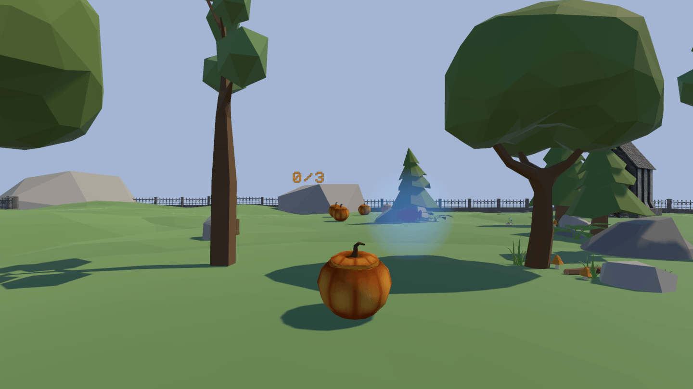

# Spoopy Treat

*Spoopy Treat* is a Unity game made for a school's recruiting process. Enjoying the concept I've found for it so much, I've decided to turn it into an actual game and will ship it as a Mofumofu product.  

This game is in fact the prototype for a longer game called *Knock On*. If *Knock On* is a platformer adventure game in a similar spirit as Spyro or Mario 64, *Spoopy Treat* is a brawl game in an arena. Both are in 3D.

---

## FIRST VERSION FOR THE SCHOOL

[LINK TO THIS VERSION'S LAST COMMIT](https://github.com/TheLycorisRadiata/game_unity_spoopytreat/tree/440a1a09e6b6f24df655d0fe97c3d8b10f8bf1fa)

### FEATURES
- The game is made with Unity.
- Installing it on Ubuntu (Linux) is not as straight forward as it seems. The Hub cannot open because it keeps crashing. The solution is to execute the AppImage file with the "--no-sandbox" option.
- Configuring the IDE for Unity.
- Version control has been used in the making of the project. Here is the .gitignore file for Unity: https://github.com/github/gitignore/blob/main/Unity.gitignore
- The game features one scene.
- The player can move with the arrow and WASD keys (or equivalent to WASD as physical keys are used).
- The player can jump with the space bar.
- The player can collide with other objects, and go through others (the small plants).
- The player moves smoothly instead of falling over at the slightest collision.
- The camera, which is not controlled by the user, follows the player in 3rd person and is right behind them.
- A fence with high invisible walls surrounds the map so objects don't fall off it.
- In case an object, the player included, manages to go out of bounds, it is put back onto the map.
- Assets from the Unity asset store are used to compose the scene. The pumpkins weren't facing the right way, so this had to be fixed.
- Moveable objects have different masses.
- The player collects candies to increase their mass, and instead of having the character be slower because of it, I have decided to make their moving speed and jumping force proportional to their mass.
- The player can only collect 3 candies, and the current number they have collected is displayed above the player's head.
- Candies have an idle animation (made not with an actual animation but with code): they have a blue halo, bob up and down, and spin on themselves.
- The scene has 5 candies in total: one is right in front of the player when the game starts to teach them to collect it, one is kept within an enclosure that the player has to jump above to reach, another one is at the end of a small platformer bit, and the last two are inside of cauldrons.
- When a full cauldron is knocked over, a candy is created and the cauldron is replaced by an empty one.
- The game is compiled for Windows 64-bit, Windows 32-bit, Mac and Linux.

### DOWNLOAD LINKS
[Windows 64-bit](https://drive.google.com/file/d/1E9B2NhY4a15ldAh5JdclrArnrq13H0u4/view?usp=sharing)  
[Windows 32-bit](https://drive.google.com/file/d/1tv8Bt5AxLdgjNghCpy7fORK90F3h-XoV/view?usp=sharing)  
[Mac](https://drive.google.com/file/d/18QgwM1pAAbZzFY2Y7FaUrqxlUyEmOtAC/view?usp=sharing)  
[Linux](https://drive.google.com/file/d/1B_Hm94iHYwdwe8fpQxhm6IjIazULjODu/view?usp=sharing)  

### ISSUES
- An increase in speed makes the player ignore collisions.
- An increase in speed and/or in mass makes pushing moveable objects more difficult, because the player would then tend to be sent flying.
- On rare occasions, the cauldrons do not empty even when knocked over.
- On rarer occasions, the camera will rotate on the x axis for a bit even when the player is immobile.

